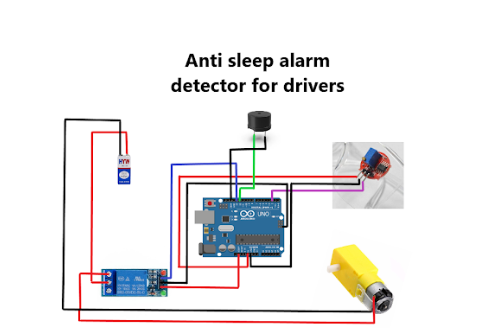

<h1>SLEEP AVOIDANCE FOR DRIVERS USING ARDUINO</h1> 
<h3>Circuit Diagram</h3>
 

<h4>Components Used</h4>
<ol>
<li>Arduino uno/nano</li>
<li>5v relay module</li>
<li>Mo motor</li>
<li>Ir sensor glass</li>
<li>wheels</li>
<li>power supply(9v)</li>
</ol>

Working Principle:
Initial Setup:

The IR sensor is continuously monitoring the driver's eye condition.
The motor and buzzer are initialized in their respective states.
When the Driver is Awake:

The IR sensor continuously reads the status of the driver’s eyes.
If the sensor detects that the eyes are open, the system is in its normal state, with the motor running and no alarm sounding.
When the Driver Shows Signs of Sleep:

If the driver’s eyes are closed (sensor detects this), the following steps occur:
The time of the event is recorded.
The system continuously monitors the sensor to check if the driver’s eyes remain closed.
If the eyes stay closed for more than 3 seconds, the buzzer is activated to alert the driver.
After 4 seconds, if the driver’s eyes remain closed, the motor is turned off, stopping the vehicle.
Reactivation of the System:

If the driver opens their eyes (sensor reads this condition), the system resets and returns to its normal operation:
The motor remains on.
The buzzer is turned off.
The time counter is reset to monitor the next potential sleep occurrence.

